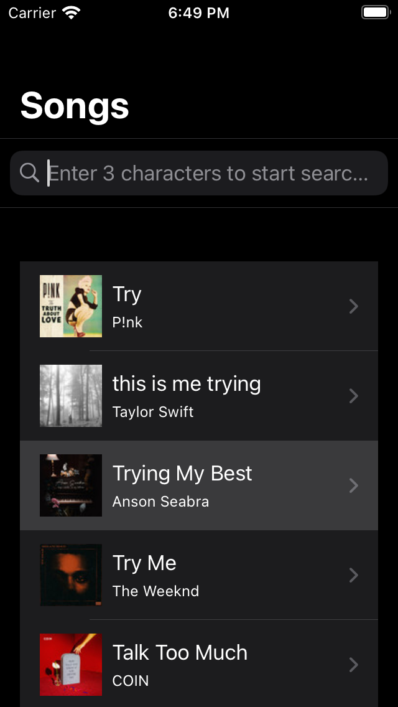
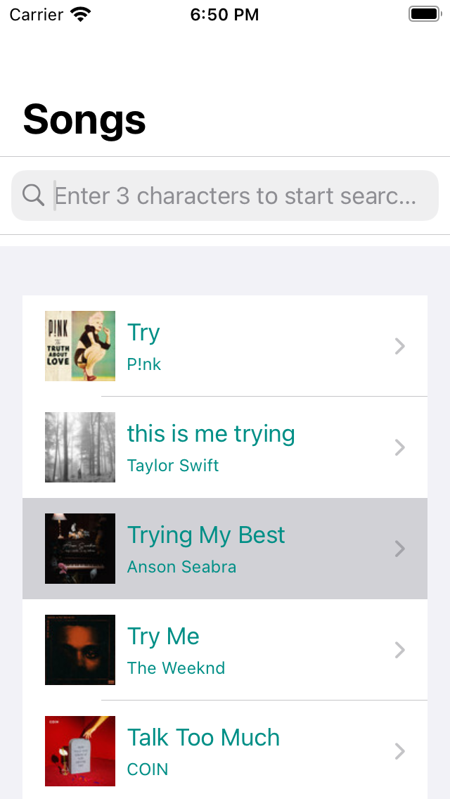

# Widgets

**SwiftUI Widget based app to track Spotify songs**

## API folder:

Contains networking code using `Combine` from **Spotify API**

## Extensions folder:

Extra functionality

## Stubs folder:

JSON for testing purposes

## ViewModels folder:

`TracksViewModel.swift` which mainly fetches the list of tracks from API past token generation.

## Views folder:

All UI elements, including list, detail and search bar.

## WidgetTests folder:

`MockAPIProvider.swift` fakes URL response from Stub `Track.json` folder. This is made possible via `API/URLSession.swift`.
